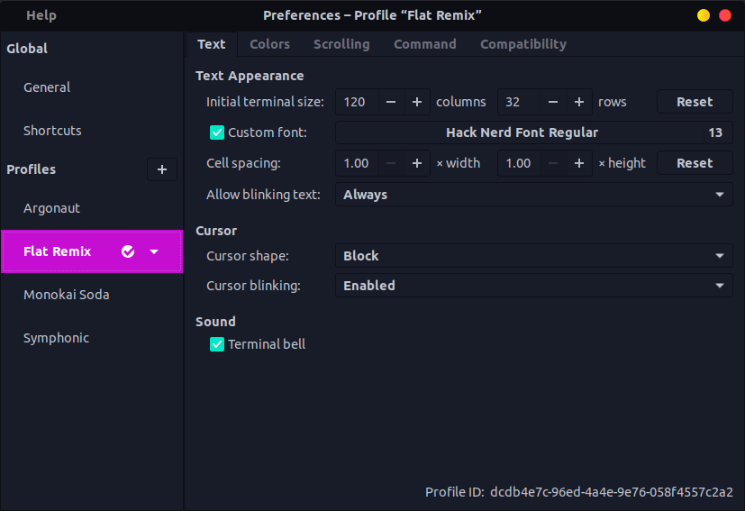

# My Personalized Linux Auto Configuration

This repository is my personal customized Linux configuration, including beautifying Linux and useful apps installations with configurations which can be installed automatically.

# Notes

If you have any interesting and useful softwares, please let me know, and I will place it in apps.

Configurations and installations is personalized by me, some options might be wrong and not are suitable for you. You may fork this repository and customize your self themes, path, configures and other options in case of breaking your system environment. Reading all the blow is first step to defend and customize your own Linux.

# Start to Install 

You can just start with:

```bash
$ git clone --submodule git@github.com:gallencalade/linux-auto-config.git
$ ./auto-install.sh
```

All is going automatically.

# Directory Structure

## auto-install.sh

This is entry of all and the installations order is intentional because of dependency of configurations, and installing every shell one by one.

## config.sh

-   Configure git user and email.

## Applications

This folder contains useful softwares installation.

### install.sh

Install applications.

1.  Installs applications and gnome extensions that can be installed by `apt-get`;
2.  Installs docker;
3.  Installs applications that can be installed by `pip`;
4.  Installs themes;
5.  Installs offline dpkgs.

### sources.list

This is Tsinghua University source installed to `/etc/apt/source.list` .

Or, you can select source from Software & Updates:


and check the software repo list after new repo is added:


### apt_get.sh

Installations from `apt-get install` command.

GCC compilers:

-   linux-headers-generic
-   build-essential
-   nasm
-   gcc
-   g++
-   gfortran
-   gdb

Clang and LLVM:

-   clang
-   llvm
-   lldb
-   clang-format
-   clang-tidy

Make and CMake:

-   cmake
-   m4
-   autoconf
-   libtool

Python3:

-   python3
-   python3-pip
-   ipython3
-   python3-wxgtk4.0

Vim:

-   vim
-   vim-doc
-   vim-scripts
-   vim-addon-manager
-   exuberant-ctags
-   cscope

Coding tools:

-   valgrind
-   git
-   curl
-   wget

SQLite:

-   sqlite3
-   sqlitebrowser
-   libsqlite3-dev

Shell:

-   zsh
-   tmux

-   trash-cli
-   autojump
-   lolcat
-   bat

Input Method:

-   fcitx
-   xsel

Compress tools:

-   unzip
-   unrar

Useful commands:

-   nepfetch
-   tree
-   htop
-   bashtop
-   net-tools
-   ifstat
-   dos2unix
-   locate
-   sysstat
-   tcpdump
-   iotop

Useful Softwares:

-   calire
-   okular
-   shutter
-   focuswriter
-   bless
-   wireshark
-   vlc
-   speedcrunch
-   zeal

### docker.sh

Docker installation shell script.

### gnome_shell_extensions.sh

Gnome shell extensions.

-   gnome-tweaks
-   gnome-shell-extension-draw-on-your-creen
-   gnome-shell-extension-system-monitor
-   gnome-shell-extension-weather
-   gnome-shell-extension-workspaces-to-dock
-   gnome-shell-extension-system-monitor
-   gnome-shell-extension-trash

### pip.sh

Softwares installed by pip.

For GDB extensions:

-   [keystone](https://github.com/keystone-engine/keystone)
-   [unicorn](https://github.com/unicorn-engine/unicorn)
-   [capstone](https://github.com/aquynh/capstone)
-   [ropper](https://github.com/sashs/Ropper)

Wallpaper manager:

-   [superpaper](https://github.com/hhannine/superpaper)


### dpkgs.sh

Install the debs in dpkgs/.

### dpkgs/

Contains the softwares installed from deb.

The next gen ls command:

-   [lsd](https://github.com/Peltoche/lsd)


MySQL APT Installation Repository:

-   [mysql-apt-config](https://dev.mysql.com/downloads/repo/apt/)

Sogou Input:

-   [sogouimebs](https://pinyin.sogou.com/linux/?r=pinyin)

### themes.sh

Install themes in themes/.

### themes/

Themes of softwares.

-   Bashtop theme - flat-remix.theme

## Fonts

Hack is my favorite font for coding and its mono-spaced font with a high number of glyphs (icons) shows below:


Every file starts with an icon.

### install.sh

Fonts installation.

1.  Installs fonts.

## System

Configurations of Linux system.

### install.sh

Install the configurations in system.

1.  Installs applications desktops;
2.  Installs system icons and themes;
3.  Installs shell extensions.

### desktops/

These desktops are apps of that specified softwares without shortcut which should be in `${HOME}/.local/share/applications` in applications menu.

### extensions/

This folder contains the gnome extensions might not be installed by apt-get, and these extensions are installed to `${HOME}/.local/share/gnome-shell/extensions`.

-   CoverflowAltTab


### icons/

The icons that could specify in gnome-tweaks which the installed path is `${HOME}/.local/share/icons`. Both icons and themes are Ant or Sweet.

-   Aqua-Dark


-   [Candy-Icons](https://github.com/EliverLara/candy-icons)


-   [Sweet Folders](https://github.com/EliverLara/Sweet-folders) - Rainbow


### themes/

The icons that could specify in gnome-tweaks which the installed path is `${HOME}/.themes`.

#### [Ant](https://github.com/EliverLara/Ant)

-   Ant-Dracular-slim-standard-buttons
-   Ant-Dracula-Slim


#### [Sweet](https://github.com/EliverLara/Sweet)

-   Sweet-Dark


## Terminal

The terminal configurations.

### install.sh

Installs configurations of terminal.

1.  Installs autojump, tmux and zsh;
2.  Configures zsh and myrc;
3.  Installs gogh with No.46 - Flat Remix terminal theme;
4.  Installs GEF for GDB.

### tmux.conf.local

My customization about tmux which splits terminal.

### zshrc

My customization about zsh configurations.

### myrc

My customized configuration of my command alias and environment path.

### [autojump/](https://github.com/wting/autojump)

Submodule about autojump which can jump to frequently-used dir.

### [bash-completion/](https://github.com/scop/bash-completion)

Bash command auto completion.

### [Gogh/](https://github.com/Mayccoll/Gogh)

Color scheme for your terminal.


### [ohmyzsh/](https://github.com/ohmyzsh/ohmyzsh)

Customized zsh configuration.


## Tools

All runnable tools.

### colortest.perl

Tests terminal color.

## Vim

Configurations of VIM editor.

### install.sh

VIM configurations installation.

1.  Git clone [vimrc](https://github.com/amix/vimrc);
2.  `ln` `vim` to `${HOME}/.vim` and `ln` `my_configs.vim` to vimrc location;
3.  Generates ctags and cscopes.

### cscope.sh

Generates `/usr/include` and `/usr/local/include` cscopes file to specified path.

### ctags.sh

Generates `/usr/include` and `/usr/local/include` ctags file to specified path.

### my_configs.vim

My configurations about VIM.

### vim/

VIM plugins with configurations folder.

# After Installation

Some options need to be customizes by applications.

## Terminal Configuration



## Tweaks Configuration


